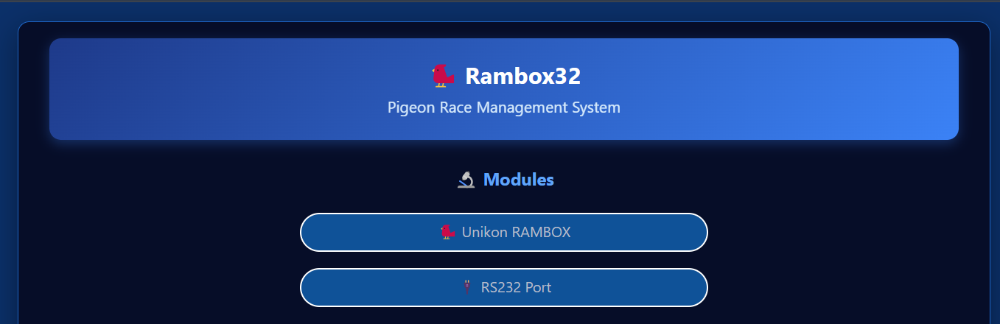

# Rambox32

**Pigeon-racing timing terminal firmware for ESP32-S3 N16R8** — part of the [Node32-HUB](https://github.com/nasp2000/Node32-HUB) project.

Compatible with vintage Unikon timing clocks — **Unikon Champ** and **Unikon Profi**. Connects via RS232 (9600 baud), with email alerts, optional OLED display, OTA updates, and a web-based control panel with live pigeon-arrival monitoring.



📷 [More screenshots](image/)

---

## Features

### Communication

Read-only terminal — listens to the Unikon bus and logs all received data. Does not send commands. Arrivals are detected via **polling** — the system continuously queries the clock and records new timestamps and ring numbers as they appear.

> **The fancier does not need to be at the loft** — as soon as a pigeon arrives, the system captures the data and sends an email alert automatically.

- **Arrivals** — pigeon arrival timestamps and ring numbers
- **Races** — race metadata, release points, and competition results
- **Loft** — loft configuration and bird registration data
- **Email alerts** — automatic notifications via SMTP TLS on new arrivals or errors

### Web UI

- Live RS232 data reception and transmission log
- Unikon terminal interface
- Machine status and event monitoring
- Email configuration and testing
- OTA firmware updates
- LCD status display (OLED 0.96")

### Display (optional)
- **OLED screen** — real-time status dashboard showing clock, date, and recent pigeon arrivals. Not required for operation.

### Reliability
- Watchdog timer and crash recovery
- HTTP Basic Authentication for web access
- OTA updates for remote firmware upgrades
- NTP time synchronization

---

## Hardware Recommendation

**ESP32-S3 N16R8** (any generic devkit with 8 MB PSRAM).

The only tested class of board.
- **MAX3232** — RS232 transceiver for Unikon communication
- **OLED 0.96" (SSD1306)** — optional I2C display for real-time status

### Wiring

```
ESP32-S3 N16R8          MAX3232                DB9 (Unikon)
─────────────────       ──────────             ─────────────
GPIO16 (UART2 RX)  ───  R1OUT (TTL out)
GPIO17 (UART2 TX)  ───  T1IN  (TTL in)
                    T1OUT ───────────────────  Pin 2 (TX)
                    R1IN  ───────────────────  Pin 3 (RX)
                    GND   ───────────────────  Pin 5 (GND)
                                               Pin 9 ───── Pin 5  ⚠️ jumper mandatory


ESP32-S3 N16R8          OLED SSD1306 (optional)
─────────────────       ───────────────────────
3.3V                ─── VCC
GND                 ─── GND
GPIO21 (I2C SDA)   ─── SDA
GPIO48 (I2C SCL)   ─── SCL
```

> **⚠️ Important:** The Unikon DB9 connector requires pins **9 and 5 to be jumpered** — the device will not communicate without this connection.

---

## Quick start

1. Flash the pre-built binary to your ESP32-S3 N16R8 (binaries in Releases) using [webflasher_Node32-HUB](https://github.com/nasp2000/webflasher_Node32-HUB). For future updates use **OTA** at `http://<esp32-ip>/ota`
2. Connect the Unikon timing equipment to the RS232 port (UART2, 9600 baud)
3. Open `http://<esp32-ip>` in a browser
4. Configure WiFi, email, and Unikon settings via the web UI

---

## Primeiro Acesso

1. Ligue o ESP32 à alimentação — ele iniciará no **modo Access Point (AP)**
2. Conecte-se à rede Wi-Fi **`NODE32-HUB`** com a senha **`node32hub`**
3. Abra o navegador e aceda a **`http://192.168.4.1`**
4. Faça login na interface web com:
   - **Utilizador:** `root`
   - **Palavra-passe:** `root`
5. Vá a **Configurações → Wi-Fi** e conecte o dispositivo à sua rede local
6. Após conectar à rede, o IP será mostrado no monitor série (OLED, se disponível) — use esse IP para aceder daí em diante

> O AP permanece ativo mesmo após configurar o Wi-Fi, servindo como fallback. Consulte o painel lateral "Acessos" para gerir sessões e permissões.

---

## License

Same as Node32-HUB — see the [main repository](https://github.com/nasp2000/Node32-HUB).
